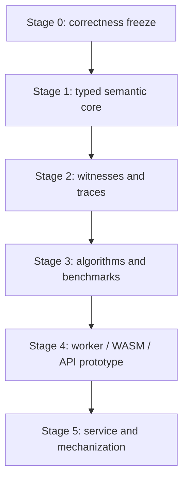

# BAPAL Architecture and Correctness-First Roadmap

**Audit date:** 2026-08-03  
**Repository baseline:** `Raycaesar/bapal@92a4ba6c7ae070d1f64a1088dbbe7ddfbb02d287`  
**Recommendation:** build Option B—a shared, typed, UI-independent semantic core with CLI/batch support—after a Stage 0 correctness freeze

## Executive recommendation

The next architecture should be a **shared research core plus browser frontend (Option B)**. The present evaluator's core valuation-class idea has strong bounded independent support, but syntax, model serialization, S5 integrity, UI state, and testing are entangled. More frontend work would deepen that coupling. A Web Worker would stop UI freezing but would not correct semantics or remove exponential allocation. WASM could improve constants but would not repair the data contract. A backend would add operations and security obligations before there is a stable core to host.

The immediate task is therefore Stage 0: freeze and specify the semantics, check in an independent oracle and conformance corpus, fix all P0/P1 defects, and establish CI. Stage 1 should then extract a pure semantic library with typed ASTs, explicit immutable model/domain representations, structural restriction, a versioned JSON schema, and a CLI. TypeScript is the lowest-friction first implementation because the current frontend is JavaScript; the independent Python oracle must remain separate. Rust/WASM is a later benchmark-driven option, not a prerequisite.

A database is not needed for parsing, model checking, witness extraction, or any semantic algorithm. It becomes useful only if a future hosted service needs accounts, saved models, job histories, shared datasets, or provenance. Z3 is likewise not a semantic foundation: it can serve as a bounded fixed-model witness/counterexample encoding or extra test oracle, but it cannot establish the presently open general satisfiability result, supply a missing finite-model theorem, or prove the evaluator correct.

## 1. Model checking is not satisfiability

### 1.1 Four different tasks

| Task | Input | Question | What the current app does |
|---|---|---|---|
| Pointed finite-model checking | finite `M`, world `w`, formula `φ` | Does `M,w ⊨ φ`? | **Yes**, by `MPL.truth` |
| Whole-given-model truth | finite `M`, formula `φ` | Which worlds in this `M` satisfy `φ`? | **Yes**, by calling `MPL.truth` at every displayed world |
| Satisfiability | formula `φ` | Is there any S5 model, finite or infinite, and point satisfying `φ`? | **No** |
| Validity | formula `φ` | Does every S5 model and point satisfy `φ`? | **No** |

The random report's current “satisfiable” column means only “true at at least one world of this one generated model.” Its “globally true” column means only “true at every world of this one generated model.” Neither answers the logical task in the corresponding row.

### 1.2 Finite explicit model checking

On a supplied finite model, BAPAL model checking is decidable directly. If the active domain has `k` complete propositional valuation classes, exactly `2^(k−1)` Boolean-definable domains contain the pointed class. A depth-first evaluator can enumerate them, restrict all relations, and recursively check the scope. This does not depend on a finite-model property because the model is already part of the input.

The audited implementation instead eagerly materializes all `2^k` subsets and filters them, then serializes/copies per candidate. Report 2 measures the resulting thresholds.

The primary literature search did **not** locate a BAPAL-specific theorem giving a tight standard complexity class for explicit finite model checking. The 2022 BAPAL paper discusses an APAL PSPACE-complete result in its motivation; that is not a BAPAL complexity theorem and must not be transferred without proof. The attached 2022 satisfiability manuscript explicitly left complexity bounds to future work, and its decidability proof was later withdrawn.

An audit-derived upper bound can still be stated carefully: with an explicit finite model, a recursive depth-first candidate enumerator uses polynomial space in the model and formula sizes, because it need retain only the current formula stack, domain masks, and subset counters. Time is exponential in `k` for one worst-case `^`; nested operators enumerate chains of restricted domains, with the singleton-class depth-two scale `3^(k−1)`. This is an implementation/algorithm observation, not a published tight-complexity classification. No matching BAPAL-specific hardness result was found in the searched primary sources.

### 1.3 Published 2022 result and operator convention

Van Ditmarsch and French's [2022 LMCS paper](https://doi.org/10.46298/lmcs-18(1:20)2022) defines BAPAL with a **universal** box over Boolean announcements and provides a finitary axiomatization/expressivity results. Its abstract explicitly says that a further decidability claim is deferred to a companion paper. The [official arXiv record](https://arxiv.org/abs/1712.05310) gives the final revision date as 2022-01-20 and repeats that deferral.

The supplied current manuscript instead makes the existential dual primitive, and the app follows it:

\[
M,w\models\Diamond_\beta\varphi
\iff
\exists\theta\in\mathcal L_{PL}\;M,w\models\langle\theta\rangle\varphi.
\]

This is compatible with the paper through `Boxβ φ := ¬Diamondβ¬φ`. The app's inherited ordinary `□` operator is not `Boxβ` and must never be used as though it were.

The supplied current manuscript separately reports a gap in the LMCS paper's printed soundness argument: a pointwise signature-reduct claim is false. The manuscript confines the consequence to that proof argument and supplies proposed repairs; it does not change the semantic clauses used by this audit. This reinforces the need to distinguish executable finite semantics from metatheoretic soundness/completeness claims.

### 1.4 Satisfiability and decidability status as of 2026-08-03

The chronology matters:

1. **2022-01-21:** the LMCS BAPAL paper was published and deferred decidability to companion work.
2. **2022-06-02:** arXiv v1 of *Satisfiability of Quantified Boolean Announcements* claimed decidability and failure of the finite-model property. The supplied `satisfiabilityofbapal_contains_error.pdf` is this claim-bearing version. It described a finite representation of possibly infinite models; it did not claim that ordinary finite-model enumeration was complete.
3. **2025-01-30:** the authors [withdrew the paper](https://arxiv.org/abs/2206.00903). The current record says the decidability proof contains errors they could not correct, that they still believe BAPAL is likely decidable and invite an independent proof, and that the lack of the finite-model property still holds.

The responsible current conclusions are:

- **Satisfiability decidability:** open/unresolved on the primary record located by this audit. The withdrawn v1 is not a valid decision-procedure citation.
- **Satisfiability complexity:** unresolved; no complexity classification can be asserted while decidability itself lacks a valid proof. The withdrawn v1 also said complexity bounds were future work.
- **Finite-model property:** negative according to the authors' current withdrawal note; the lack-of-FMP claim was explicitly retained. Thus finite model search cannot be a complete satisfiability method.
- **Complete bounded finite search:** no. A satisfiable BAPAL formula may require an infinite model, so no bound on ordinary finite models follows from the retained result.
- **Later resolution:** a primary-source search through 2026-08-03 found no replacement proof resolving the withdrawn decidability claim. Some later papers repeat the older claim, but repetition predating or ignoring the withdrawal is not a new proof.

The separate 2021 paper [“No Finite Model Property for Logics of Quantified Announcements”](https://arxiv.org/abs/2106.11498) concerns APAL, GAL, and CAL as stated in its abstract; it should not be cited as the proof for BAPAL. The BAPAL status here comes from the current companion-paper record. The underlying lack-of-FMP proof was not formally reverified in this software audit, so the report attributes it precisely to the authors.

### 1.5 What the app may claim

Accurate description:

> A bounded, explicit finite pointed-model checker and visualization for the existential BAPAL modality, with optional S5 model-construction assistance.

Inaccurate descriptions:

- “BAPAL decision procedure”;
- “satisfiability solver”;
- “validity checker”;
- “finite-model search proves unsatisfiability”;
- “S5 semantics” without confirming that the loaded/current relations are equivalence relations;
- “research-verified” based only on the self-tests or random HTML report.

Finding one finite pointed model does establish satisfiability of that formula under the represented semantics. Failing to find one, or observing false at every world of one model, establishes nothing about unsatisfiability.

## 2. Architecture options

### 2.1 Comparative assessment

| Criterion | Option A: improved static teaching tool | Option B: shared research core + browser | Option C: hosted research service |
|---|---|---|---|
| Mathematical reliability | Medium after P0/P1 fixes; UI/core coupling remains a risk | **High potential**: one typed core, separate oracle, CLI and browser conformance | No higher than its core; hosting alone adds no correctness |
| Implementation effort | Low–medium | Medium | High |
| Performance | Browser-limited; worker improves responsiveness, not complexity | High potential through bitsets, memoization, optional WASM; batch CLI avoids UI overhead | Can add larger machines/queues, but exponential work remains |
| Maintainability | Moderate; legacy globals/D3 coupling persists | **Best** if API/schema are stable and pure | Lowest initially because core + API + queue + auth + operations must evolve together |
| Deployment complexity | Very low; static assets | Low–medium; static frontend plus packaged core/CLI | High; API, workers, quotas, monitoring, upgrades, incident response |
| Security | Small server attack surface; malicious inputs can still freeze a user's tab | Similar browser profile; CLI must validate untrusted files | Highest burden: denial-of-service, tenant isolation, auth, rate limits, input limits, result privacy |
| Reproducibility | Medium with downloadable inputs/manifests | **High**: deterministic CLI, versioned schema, same core in browser, independent oracle | High only if jobs pin versions/environments and export complete bundles |
| Teaching suitability | **Excellent** | Excellent once UI remains simple | Moderate; unnecessary network/account dependency |
| Research suitability | Low–medium | **Best next step** | Potentially high for shared/heavy workloads, but only after Option B matures |

### 2.2 Option A — improved static teaching tool

Keep D3 visualization and pure browser deployment. Move expensive checks to a Web Worker, enforce documented limits, and add witness animation, explanations, and import/export.

Strengths:

- minimal deployment and privacy surface;
- easy classroom use and offline/static hosting;
- a worker can keep the graph responsive and allow cancellation;
- no database or backend is required.

Limits:

- if semantic code remains in legacy `MPL.js`, tests and UI state remain entangled;
- a worker does not make exponential enumeration cheaper;
- batch reproducibility and machine APIs remain awkward;
- browser/device differences complicate publication benchmarks.

Option A is a sensible product profile but not the best *architecture transition*. Its useful UI features should be built on Option B's core.

### 2.3 Option B — shared research core plus browser frontend

Create a pure semantic package with:

- typed, immutable formula AST;
- explicit `Model`, `AgentId`, `AtomId`, `WorldId`, and restricted-domain types;
- a versioned JSON schema separate from any compact share URL;
- parser and pretty-printer with one documented grammar;
- finite model checker returning Boolean results, witnesses, and traces;
- deterministic CLI and batch JSON/CSV mode;
- browser adapter using the same package;
- an independent Python implementation retained only for differential verification.

Preferred implementation sequence:

1. TypeScript core, because it reduces migration risk and can run in Node, a browser worker, and the existing frontend.
2. Optimize the model/domain representation in TypeScript and benchmark.
3. Consider a Rust core compiled to WASM only if measured workloads remain too slow or memory-heavy and the FFI/schema cost is justified.

Python should remain the independent oracle, not become the browser production core merely because it was convenient for verification. A Rust or second TypeScript implementation must not replace the independent oracle with a translation of itself.

Why this is the recommendation:

- reliability work becomes reusable by teaching UI, CLI, batch experiments, and any later service;
- semantics stop depending on D3 globals, URL strings, and visual variable counts;
- every frontend uses one versioned truth engine;
- deterministic CLI runs can produce paper-ready manifests;
- worker/WASM/backend choices remain reversible deployment adapters rather than semantic forks.

### 2.4 Option C — hosted research service

Separate frontend and backend; expose versioned endpoints for parsing, checking, witnesses, explanation traces, batches, and benchmarks. Execute jobs through workers with cancellation, time/memory limits, deterministic seeds, and downloadable provenance bundles.

This is justified only when there is demonstrated need for one or more of:

- computations too large for target browsers after algorithmic optimization;
- long-running or queued batch jobs;
- collaborative saved datasets and stable citations;
- centralized reproducible environments;
- shared benchmark comparison.

It is not justified merely because BAPAL is computationally expensive. A server can move a freeze away from the browser, but without quotas it converts it into a denial-of-service problem. Required controls include schema validation, formula/world/edge/class limits, CPU and memory isolation, cancellation, tenant quotas, rate limits, deterministic runtime pinning, result integrity hashes, and no execution of user-supplied code.

The service should call exactly the Option B core. It should never grow a separate backend semantics.

## 3. Database, backend, and persistence assessment

### 3.1 Database

**No database is needed now.** The semantic algorithm is a pure computation over `(model, point, formula, options)`. Parsing, valuation partitions, domain enumeration, memoization, witness extraction, and trace construction are in-memory operations.

A future database may store:

- user accounts and permissions;
- saved models/formulas;
- job state and histories;
- shared benchmark/test corpora;
- immutable run manifests and provenance metadata;
- stable citation identifiers and access-control records.

Large result bundles and corpora would usually belong in object/file storage, with a database indexing their metadata. A local teaching tool and initial CLI need neither.

### 3.2 Backend

A backend is not a performance algorithm. It is an execution and collaboration boundary. Build one only after:

- the typed core and schema are stable;
- browser-worker and CLI benchmarks identify workloads that materially benefit;
- user demand exists for queues, sharing, or centralized provenance;
- security/operations ownership is available.

Until then, static hosting plus a Web Worker and downloadable bundles is simpler, safer, and more reproducible.

## 4. D3, Z3, SAT/SMT, BDDs, and alternative cores

### 4.1 D3 is not Z3

D3 is the current data-visualization library. It lays out worlds and arrows and has no role in logical solving. Z3 is an SMT solver. Similar spelling does not imply any architectural relationship.

### 4.2 A precise bounded Z3 use

For a **fixed finite model**, one can introduce a Boolean selector `xC` for each valuation class `C`, constrain the pointed class selector to true, and encode whether subformulas hold at each world under the selected domain. For one existential `^`, Z3/SAT can search for a witness assignment to the selectors. A bounded equivalence check could also ask whether there exists a model of at most `N` worlds, with explicitly constrained S5 relation matrices and valuations over `m` atoms, on which two bounded formulas differ.

Nested PAL/BAPAL requires domain-indexed truth variables or bounded unrolling. Universal Boolean-announcement duals introduce quantifier alternation: plain SAT needs enumeration/duality transformations, while a direct encoding is closer to QBF or quantified SMT. Whether Z3 outperforms a domain-mask evaluator is an empirical question; for this finite set problem, bitsets, memoization, BDDs, or a SAT solver may be simpler.

Useful near-term Z3 roles:

- bounded counterexample search for proposed rewrite laws;
- bounded model generation subject to S5 constraints;
- independent witness cross-checks for fixed finite instances;
- test-case minimization if an objective/iterative bound is supplied.

What Z3 cannot establish here:

- general BAPAL satisfiability decidability;
- a finite-model property or complete finite bound;
- validity from passing bounded instances;
- correctness of the JavaScript/TypeScript evaluator without a proved faithful encoding and a proof connecting all inputs;
- termination of an unbounded procedure.

Z3 should therefore be an optional bounded verification backend, not the next core.

### 4.3 Performance techniques in priority order

| Technique | Assessment | Priority |
|---|---|---:|
| Domain/world bit sets | Natural representation for restrictions, successors, valuation classes, and truth sets | 1 |
| Lazy candidate generation | Removes the eager `2^k` array and lets early witnesses return without full allocation | 1 |
| Cached valuation partitions | Cache by domain mask/model version; avoid recomputation per point/subcall | 1 |
| Structural formula IDs/hashing | Stable keys for memoization and manifests | 1 |
| Memoization `(formulaId, domainMask, world)` | Eliminates repeated subproblem evaluation across branches/worlds | 1 |
| Dynamic programming/truth-set evaluation | Compute sets of satisfying worlds where profitable rather than one point at a time | 2 |
| No physical model copies | Keep one immutable base model and pass domain masks | 1 |
| BDDs | Promising if selector/domain sets become highly structured; benchmark after bitsets | 3 |
| SAT | Useful for existential bounded witnesses/counterexamples; encoding overhead may dominate small cases | 3 |
| SMT/Z3 | Useful when richer constraints/integers or bounded symbolic models matter | 3 |
| Web Worker | Essential for responsiveness/cancellation after core extraction; does not reduce work | 2 |
| WebAssembly/Rust | May improve constants and memory discipline; only after algorithmic fixes and profiling | 3 |
| Python production core | Good CLI/prototype ecosystem, poor direct browser fit; retain as independent oracle | — |

Symbolic methods must be benchmarked on representative families, not adopted because “exponential” appears in the analysis. For the current bounds, a compact immutable bitset evaluator with memoization is likely the highest-value first change.

## 5. Research-facing feature priorities

### 5.1 Near-term, high value

| Priority | Feature | Why it matters | Correctness acceptance criterion |
|---:|---|---|---|
| 1 | Explicit `^` witness extraction | Converts an unexplained Boolean into inspectable evidence | Replaying returned announcement through independent PAL yields the claimed scope truth |
| 1 | Selected-domain animation | Makes Boolean announcement restriction teachable | Highlighted worlds exactly equal witness domain; all removed edges touch a removed world |
| 1 | Explanation traces for `K`, PAL, and `^` | Exposes vacuity, counterexample successors, removed worlds, and witness search | Every trace node is independently replayable and references stable IDs |
| 1 | Correctly named batch JSON output | Supports reproducible calculations without UI scraping | Versioned schema; no “satisfiable/valid” labels for one-model results |
| 1 | Stable model/formula/run identifiers | Enables comparison and citation | Canonical serialization/hash independent of map insertion order |
| 1 | Deterministic seeds and run manifests | Makes generated cases reproducible | Re-run from bundle reproduces byte-identical semantic results |
| 1 | Versioned benchmark suites | Prevents invisible performance regressions | CI compares time/memory within declared environment/tolerances |
| 2 | Counterexample worlds | Essential for false `K` and future universal operators | Returned successor/domain directly falsifies the checked universal condition |
| 2 | Failure/model minimization | Turns fuzz failures into actionable cases | Minimized case is replayed and no permitted single reduction preserves failure |

For a BAPAL witness domain, construct a Boolean formula with the finite separator method from Report 2. The first implementation may show the selected valuation-class union even before formula minimization. A canonical witness policy—fewest retained classes, then lexicographic domain, with a deterministic separator formula—will stabilize tests and exports.

### 5.2 Medium-term

- formula simplification with equivalence checked against rewrite laws and bounded counterexample search;
- algorithm comparison mode (enumeration, memoized bitset, optional BDD/SAT) using exactly the same schema and corpus;
- paper-ready JSON/CSV plus a human-readable HTML/PDF summary containing hashes, bounds, seeds, runtime, and limitations;
- a machine-checkable local API/CLI with streaming batch results and resource limits;
- corpus-driven model minimization and canonical isomorphism reduction;
- universal Boolean-announcement display only as an explicit dual, never by reusing ordinary `□`.

CSV is appropriate for flat result rows, not for preserving models/ASTs. JSON should be canonical. A result bundle should include both.

### 5.3 Long-term/speculative

- formalize finite models, PAL restriction, Boolean valuation classes, and the optimized evaluator in Lean, Coq, or Isabelle;
- prove the finite valuation-class theorem and a refinement theorem connecting the executable evaluator to the semantics;
- extract or verify a production evaluator if the chosen proof assistant/toolchain supports it;
- mechanize witness soundness and, for finite explicit models, completeness of domain enumeration;
- hosted collaborative corpora and long-running job service;
- symbolic algorithms for special formula/model families.

Formal mechanization can prove the finite explicit-model checker correct. It does not by itself resolve general BAPAL satisfiability decidability; that is a separate metatheoretic research problem.

## 6. Staged roadmap

### Stage 0: correctness freeze and independent oracle

**Purpose**

Freeze the intended finite semantics and eliminate every P0/P1 contract defect before refactoring or adding features.

**Files/components affected**

- a normative semantic/grammar specification and decision log;
- `js/MPL.js`, `js/app.js`, `API-Reference.md`, `README.md`, `index.html`, and BAPAL verification documentation;
- a versioned `schemas/` definition for formula AST/model/run data;
- independent `oracle/` package kept separate from production code;
- `tests/corpus/`, property/differential harness, benchmark manifests, and CI workflow;
- random report terminology and exporter.

**Prerequisites**

- accept this audit's formal source hierarchy;
- decide and document supported identifier syntax, the absence-means-false vocabulary convention, multi-agent shorthand, arbitrary-frame support status, and existential/universal symbols;
- decide legacy URL migration behavior.

**Tests**

- preserve and automate the exact independent matrix in Report 2;
- fast per-PR subset plus scheduled full 6,501,302-evaluation baseline;
- property-based AST print/parse and model encode/decode with shrinking;
- exhaustive small S5 editor operation sequences across at least two agents;
- malformed input rejection/rollback tests;
- targeted P0/P1 regression corpus;
- live browser smoke tests and current benchmark baselines.

**Measurable acceptance criteria**

1. P0-01 and every P1 entry in Report 1 is closed with a minimized regression.
2. `parse(print(ast))` passes 100,000 generated supported ASTs and the bounded exhaustive formula corpus.
3. Model encode/decode is structurally and truth preserving for every supported identifier and rejects malformed inputs atomically.
4. The full independent matrix reports zero semantic mismatches, zero serialization failures, and zero parser round-trip failures.
5. S5 mode either validates/normalizes on entry or refuses a non-S5 model; every accepted S5 editing operation preserves every declared agent relation.
6. Reports use `trueSomewhereInModel`/`trueAtEveryWorldInModel`-type labels and explicitly disavow satisfiability/validity inference.
7. CI pins runtimes/dependencies and publishes machine-readable manifests with commit and hashes.

**Risks**

- fixing identifiers/schema can break old share URLs;
- choosing normalization versus rejection for S5 imports changes user expectations;
- making hidden valuation state visible may expose previously unnoticed model differences.

**Change classification:** intended semantics remain the same; parser/model contracts and UI behavior change; verification architecture is added.

### Stage 1: pure semantic core and typed model/formula representations

**Purpose**

Separate mathematics from D3, DOM state, URLs, and compact serialization. Establish one production core for browser, CLI, and future service use.

**Files/components affected**

- new core modules such as `core/ast.ts`, `core/model.ts`, `core/domain.ts`, `core/parser.ts`, `core/print.ts`, `core/evaluate.ts`, and `core/schema.ts`;
- CLI/batch entry point;
- thin browser adapter replacing direct semantic use of legacy globals;
- legacy model-string importer isolated at the boundary;
- package/dependency/build configuration.

**Prerequisites**

- Stage 0 normative grammar, schema, corpus, and CI green;
- explicit decision on TypeScript build/tooling and browser support.

**Tests**

- legacy-vs-new core differential checks on all supported corpus cases;
- new core vs independent Python oracle on exhaustive/random matrices;
- mutation tests of every semantic clause;
- purity/immutability tests: evaluation cannot alter input model/AST;
- CLI/browser result parity and deterministic output snapshots.

**Measurable acceptance criteria**

1. Core has no DOM, D3, URL, MathJax, or browser-global dependency.
2. Internal PAL/BAPAL restriction passes domain masks and never serializes a model to copy it.
3. All public APIs use typed results/errors and the versioned schema.
4. Browser and CLI produce identical canonical truth results and IDs for the full corpus.
5. Independent differential and mutation suites are green; legacy evaluator can be retired behind a compatibility fixture.

**Risks**

- accidental semantic drift during migration;
- dual maintenance if legacy and new engines coexist too long;
- build complexity in a formerly no-build static site.

**Change classification:** major architecture change; no intended semantic change; small UI adapter changes.

### Stage 2: witness extraction and explanation traces

**Purpose**

Make results inspectable and scientifically exportable. Return why a formula is true/false, not only a Boolean.

**Files/components affected**

- evaluator result/trace algebra;
- canonical Boolean witness constructor;
- trace validator/replayer;
- D3 restricted-model animation and explanation panel;
- CLI/JSON exports.

**Prerequisites**

- immutable typed domains and stable IDs from Stage 1;
- agreed canonical witness ordering and trace schema.

**Tests**

- replay every `^` witness as a PAL update in the independent oracle;
- verify each false `K` counterexample is accessible and falsifies the scope;
- verify PAL trace truth set and all relation restrictions;
- deterministic witness/trace snapshots under serialization and renaming;
- browser animation/display parity with exported trace.

**Measurable acceptance criteria**

1. Every true `^A` result returns a domain union and finite Boolean witness whose replay satisfies `A` at the point.
2. Every trace references only valid versioned model/formula/world IDs.
3. Replaying a trace independently yields the same final Boolean for the full corpus.
4. UI animation highlights exactly the exported surviving domain and can be stepped without recomputation.
5. Batch output includes witness/trace or an explicit resource-limited omission reason.

**Risks**

- witnesses can be correct but unreadably large;
- proof-like traces can consume more memory than truth checking;
- canonical minimization itself may be expensive.

**Change classification:** semantic result API expands but truth conditions do not; UI and export formats change.

### Stage 3: performance engineering and benchmarks

**Purpose**

Remove avoidable allocation/copying and repeated subproblems before changing runtime or deployment architecture.

**Files/components affected**

- bitset model/domain representation;
- lazy valuation-class subset iterator;
- partition and truth memo caches;
- structural hashes and formula IDs;
- truth-set/dynamic-programming evaluator paths;
- benchmark harness, machine-readable baselines, profiler documentation;
- optional experimental BDD/SAT adapters kept outside the trusted default path.

**Prerequisites**

- Stage 1 pure core and Stage 2 replayable witnesses;
- correctness CI able to compare every optimization with the oracle and unoptimized reference mode.

**Tests**

- identical results/witness replay across optimized/unoptimized/oracle engines;
- cache-key collision and invalidation tests;
- memory/time benchmarks across `n,e,k,^` depth, PAL depth, and branching;
- adversarial early-witness, always-false, nested, PAL-prefix, and branch families from Report 2;
- performance-regression CI in a pinned environment.

**Measurable acceptance criteria**

1. Early-witness `k=22` no longer materializes the full power set or fails under a 256 MiB core-process budget.
2. On the recorded dense Node family, depth-1 false `k=14` and depth-2 false `k=10` improve by at least 5× without weaker correctness coverage.
3. Repeated evaluation at all worlds reuses partitions/subproblems and is measurably faster than `n` independent calls.
4. Every benchmark emits commit, runtime, hardware, inputs, hashes, time, memory, and timeout status.
5. No optimization is merged unless the full independent matrix remains mismatch-free.

**Risks**

- cache memory can replace compute bottlenecks with retention bottlenecks;
- structural hashes can become correctness-critical if collisions are not guarded;
- BDD/SAT overhead may regress normal teaching cases.

**Change classification:** internal performance architecture changes; no semantic or necessary UI change.

### Stage 4: browser worker/WASM or backend prototype, only if justified

**Purpose**

Make expensive checks cancellable and keep the UI responsive; evaluate alternate execution targets only against Stage 3 evidence.

**Files/components affected**

- Web Worker protocol and cancellation/resource-budget controls;
- progress/result streaming adapter;
- optional Rust/WASM package and conformance bridge;
- only if justified, a stateless bounded API/worker prototype using the same core/schema.

**Prerequisites**

- Stage 3 benchmark suite and stable pure core;
- quantified target workloads and browser support requirements;
- for a backend prototype, an explicit threat model and operational owner.

**Tests**

- worker/main-thread parity and deterministic cancellation;
- UI responsiveness during worst allowed job;
- hard time/memory/formula/world/class limits;
- worker crash/restart and stale-result rejection;
- WASM/backend conformance against core/oracle and bundle reproducibility;
- security tests for oversized/malformed inputs and job isolation.

**Measurable acceptance criteria**

1. Browser editing/animation remains responsive during the largest advertised check.
2. Cancellation terminates a worker job within 250 ms and never applies a late result.
3. Every bounded failure returns a typed timeout/memory/cancel status, never a silent partial truth result.
4. WASM is adopted only if it provides a reproducible material gain—suggested threshold at least 2× on target bottlenecks or a necessary memory reduction—without semantic divergence.
5. A backend proceeds beyond prototype only if documented workloads cannot be acceptably handled by the worker/CLI and there is real sharing/queue demand.

**Risks**

- protocol/version drift between UI and worker;
- WASM debugging and toolchain burden;
- a backend creates denial-of-service, privacy, and operations obligations;
- moving computation can mask rather than solve exponential behavior.

**Change classification:** UI execution and deployment architecture change; semantics remain shared and unchanged.

### Stage 5: research service, persistence, and formal mechanization, only if justified

**Purpose**

Support collaborative long-running research with durable provenance and obtain machine-checked guarantees for the finite semantic core.

**Files/components affected**

- versioned service API, queue/workers, quotas, monitoring, and downloadable bundles;
- optional relational metadata store and object storage;
- authentication/authorization only if user persistence requires it;
- formal definitions/proofs and an extraction/refinement boundary in the selected proof assistant;
- public benchmark/corpus registry.

**Prerequisites**

- sustained demand demonstrated after Stage 4;
- stable schema/core and security/operations resources;
- formal-methods expertise and an agreed proof statement;
- data retention, privacy, and citation policies.

**Tests**

- deterministic job replay from exported bundles;
- tenant isolation, quota, cancellation, recovery, migration, and integrity tests;
- service/core/oracle conformance on every release;
- disaster recovery for provenance records;
- proof-assistant checking in CI;
- refinement tests linking serialized inputs to formal objects.

**Measurable acceptance criteria**

1. Every result bundle is self-describing, content-hashed, version-pinned, and reproducible in the CLI.
2. Jobs enforce CPU/memory/time quotas and cancellation without cross-tenant leakage.
3. Persistence is introduced only for declared user/job/provenance requirements; semantic evaluation remains stateless.
4. The proof assistant establishes at least: finite valuation-class domain completeness, PAL restriction correctness, and soundness/completeness of the executable finite checker with respect to the formal finite semantics.
5. Publications can cite immutable run and corpus identifiers with downloadable machine-readable evidence.

**Risks**

- high long-term operations and migration cost;
- formalization scope creep into the unresolved satisfiability problem;
- divergence between proved and deployed evaluator;
- storing research/user data creates governance duties.

**Change classification:** major deployment/persistence architecture and formal-verification work; no intended semantic change to finite model checking.

## 7. Dependency order

The arrows are gates, not a commitment to build every later stage. Stage 4 and Stage 5 require evidence-based go/no-go decisions. A Web Worker may be introduced early as a thin safety wrapper once the Stage 1 core exists, but it must not displace Stage 3 algorithm work.

## 8. Final verdict questions

1. **Is the current BAPAL evaluator semantically correct on the tested finite S5 models?** Yes within the one-character representation and exact bounds: 6,501,302 independent evaluations agreed. This is testing evidence, not proof. The unrestricted raw API has a concrete P0 multi-character-atom failure.
2. **What remains unverified?** Unbounded/larger formulas and models, infinite models, full parser/input space, all UI edit sequences, cross-runtime behavior, witness correctness because no witnesses exist yet, and every satisfiability/validity/metatheoretic claim.
3. **Is the current app adequate for teaching?** Conditionally for small curated examples, with explicit finite-model/S5/vocabulary/performance warnings. Fix P0/P1 first for dependable classroom use.
4. **Is it adequate for research calculations?** No. It lacks a stable semantic boundary, checked-in independent oracle, versioned schema/corpus, CI, provenance bundle, resource controls, and correct scientific labels.
5. **What is the largest reliable problem size now?** No world-only bound is meaningful. On the measured dense family, interactive use should stay roughly at `k≤10` for nontrivial nested `^` and `k≤12` for one worst-case depth-1 `^`; `k=13` took 11.2 seconds and `k=14` blocked beyond 20 seconds. Node one-point worst depth-1 timed out at `k=18`, depth-two at `k=12`, and eager allocation OOMed at `k=22` even with an early witness.
6. **Is valuation-class enumeration correct, and under what assumptions?** Yes on finite models when classes use complete valuations over one shared vocabulary, absent atoms uniformly mean false, and every atom name is preserved across restriction/copy. A finite separator proof establishes definability even for a countably infinite formal vocabulary. The app's multi-character serialization violates name preservation.
7. **What next: frontend, semantic core, Worker/WASM, or backend?** Stage 0, then a pure typed semantic core. Add a worker after the core for responsiveness; consider WASM only after algorithmic benchmarks; build a backend only for demonstrated queue/sharing workloads.
8. **Is a database needed now?** No. It is not part of the semantic computation. It is optional later for users, jobs, shared corpora, and provenance.
9. **Is Z3 useful?** Yes only for precisely bounded fixed-model witness/counterexample encodings or an additional bounded oracle. It cannot prove general decidability, supply an FMP, decide unbounded satisfiability, or certify production code by itself.
10. **What should the next Codex implementation task be?** Implement Stage 0 as one reviewable correctness PR: add the normative grammar/model schema and independent-oracle conformance harness; fix multi-character model encoding/deep copy, parser/printer closure, S5 toggle/new-world invariants, atomic model-load validation, hidden valuation disclosure, and random-report terminology; add CI and a machine-readable manifest. Do not add new UI features in that task.

## 9. Decision

Build **Option B** in stages. The shortest trustworthy path is:

1. freeze/correct the current contract;
2. extract a typed pure core;
3. expose witnesses and traces;
4. optimize domain algorithms under a reproducible benchmark suite;
5. isolate browser computation in a worker;
6. pursue WASM, a backend, persistence, or mechanization only where measured research needs justify them.

That sequence preserves the playground's teaching value while creating a credible foundation for scientific computation. It also keeps the open BAPAL satisfiability problem clearly outside the claims of a finite explicit-model checker.
